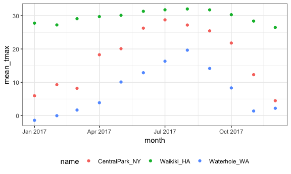
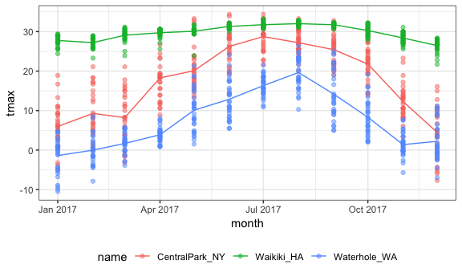
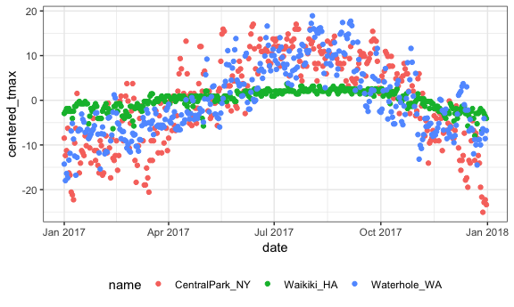

EDA
================
Eric Morris
10/4/2018

Loading in the weather\_df

``` r
weather_df = 
  rnoaa::meteo_pull_monitors(c("USW00094728", "USC00519397", "USS0023B17S"),
                      var = c("PRCP", "TMIN", "TMAX"), 
                      date_min = "2017-01-01",
                      date_max = "2017-12-31") %>%
  mutate(
    name = recode(id, USW00094728 = "CentralPark_NY", 
                      USC00519397 = "Waikiki_HA",
                      USS0023B17S = "Waterhole_WA"),
    tmin = tmin / 10,
    tmax = tmax / 10,
    month = lubridate::floor_date(date, unit = "month")) %>%
  select(name, id, everything())
```

Start grouping
--------------

``` r
weather_df %>% 
  group_by(name, month)
```

    ## # A tibble: 1,095 x 7
    ## # Groups:   name, month [36]
    ##    name           id          date        prcp  tmax  tmin month     
    ##    <chr>          <chr>       <date>     <dbl> <dbl> <dbl> <date>    
    ##  1 CentralPark_NY USW00094728 2017-01-01     0   8.9   4.4 2017-01-01
    ##  2 CentralPark_NY USW00094728 2017-01-02    53   5     2.8 2017-01-01
    ##  3 CentralPark_NY USW00094728 2017-01-03   147   6.1   3.9 2017-01-01
    ##  4 CentralPark_NY USW00094728 2017-01-04     0  11.1   1.1 2017-01-01
    ##  5 CentralPark_NY USW00094728 2017-01-05     0   1.1  -2.7 2017-01-01
    ##  6 CentralPark_NY USW00094728 2017-01-06    13   0.6  -3.8 2017-01-01
    ##  7 CentralPark_NY USW00094728 2017-01-07    81  -3.2  -6.6 2017-01-01
    ##  8 CentralPark_NY USW00094728 2017-01-08     0  -3.8  -8.8 2017-01-01
    ##  9 CentralPark_NY USW00094728 2017-01-09     0  -4.9  -9.9 2017-01-01
    ## 10 CentralPark_NY USW00094728 2017-01-10     0   7.8  -6   2017-01-01
    ## # ... with 1,085 more rows

``` r
weather_df %>% 
  group_by(name, month) %>% 
  summarize(number = n())
```

    ## # A tibble: 36 x 3
    ## # Groups:   name [?]
    ##    name           month      number
    ##    <chr>          <date>      <int>
    ##  1 CentralPark_NY 2017-01-01     31
    ##  2 CentralPark_NY 2017-02-01     28
    ##  3 CentralPark_NY 2017-03-01     31
    ##  4 CentralPark_NY 2017-04-01     30
    ##  5 CentralPark_NY 2017-05-01     31
    ##  6 CentralPark_NY 2017-06-01     30
    ##  7 CentralPark_NY 2017-07-01     31
    ##  8 CentralPark_NY 2017-08-01     31
    ##  9 CentralPark_NY 2017-09-01     30
    ## 10 CentralPark_NY 2017-10-01     31
    ## # ... with 26 more rows

``` r
weather_df %>% 
  count(name, month)
```

    ## # A tibble: 36 x 3
    ##    name           month          n
    ##    <chr>          <date>     <int>
    ##  1 CentralPark_NY 2017-01-01    31
    ##  2 CentralPark_NY 2017-02-01    28
    ##  3 CentralPark_NY 2017-03-01    31
    ##  4 CentralPark_NY 2017-04-01    30
    ##  5 CentralPark_NY 2017-05-01    31
    ##  6 CentralPark_NY 2017-06-01    30
    ##  7 CentralPark_NY 2017-07-01    31
    ##  8 CentralPark_NY 2017-08-01    31
    ##  9 CentralPark_NY 2017-09-01    30
    ## 10 CentralPark_NY 2017-10-01    31
    ## # ... with 26 more rows

General grouped summaries
-------------------------

``` r
weather_df %>% 
  group_by(name, month) %>% 
  summarize(number = n(),
            mean_tmax = mean(tmax, na.rm = TRUE),
            median_prcp = median(prcp, na.rm = TRUE),
            sd_tmin = sd(tmin, na.rm = TRUE))
```

    ## # A tibble: 36 x 6
    ## # Groups:   name [?]
    ##    name           month      number mean_tmax median_prcp sd_tmin
    ##    <chr>          <date>      <int>     <dbl>       <dbl>   <dbl>
    ##  1 CentralPark_NY 2017-01-01     31      5.98           0    4.47
    ##  2 CentralPark_NY 2017-02-01     28      9.28           0    5.05
    ##  3 CentralPark_NY 2017-03-01     31      8.22           0    5.78
    ##  4 CentralPark_NY 2017-04-01     30     18.3            0    3.82
    ##  5 CentralPark_NY 2017-05-01     31     20.1            0    3.75
    ##  6 CentralPark_NY 2017-06-01     30     26.3            0    4.23
    ##  7 CentralPark_NY 2017-07-01     31     28.7            0    2.32
    ##  8 CentralPark_NY 2017-08-01     31     27.2            0    2.06
    ##  9 CentralPark_NY 2017-09-01     30     25.4            0    3.42
    ## 10 CentralPark_NY 2017-10-01     31     21.8            0    4.42
    ## # ... with 26 more rows

This is still a tibble

``` r
weather_df %>% 
  group_by(name, month) %>% 
  summarize(number = n(),
            mean_tmax = mean(tmax, na.rm = TRUE),
            median_prcp = median(prcp, na.rm = TRUE),
            sd_tmin = sd(tmin, na.rm = TRUE)) %>% 
  ggplot(aes(x = month, y = mean_tmax, color = name)) +
  geom_point()
```



``` r
month_df = 
  weather_df %>% 
  group_by(name, month) %>% 
  summarize(number = n(),
            mean_tmax = mean(tmax, na.rm = TRUE),
            median_prcp = median(prcp, na.rm = TRUE),
            sd_tmin = sd(tmin, na.rm = TRUE)) 

ggplot(weather_df, aes(x = month, y = tmax, color = name)) +
  geom_point(alpha = .5) +
  geom_line(data = month_df, aes(x = month, y = mean_tmax))
```

    ## Warning: Removed 3 rows containing missing values (geom_point).



Tidy is not always best for humans

``` r
weather_df %>%
  group_by(name, month) %>%
  summarize(mean_tmax = mean(tmax, na.rm = TRUE)) %>% 
  spread(key = name, value = mean_tmax) %>% 
  knitr::kable(digits = 3)
```

| month      |  CentralPark\_NY|  Waikiki\_HA|  Waterhole\_WA|
|:-----------|----------------:|------------:|--------------:|
| 2017-01-01 |            5.977|       27.758|         -1.400|
| 2017-02-01 |            9.282|       27.218|         -0.018|
| 2017-03-01 |            8.223|       29.077|          1.674|
| 2017-04-01 |           18.273|       29.713|          3.873|
| 2017-05-01 |           20.090|       30.107|         10.097|
| 2017-06-01 |           26.263|       31.310|         12.873|
| 2017-07-01 |           28.739|       31.760|         16.326|
| 2017-08-01 |           27.194|       32.016|         19.645|
| 2017-09-01 |           25.433|       31.743|         14.160|
| 2017-10-01 |           21.787|       30.287|          8.313|
| 2017-11-01 |           12.290|       28.383|          1.380|
| 2017-12-01 |            4.474|       26.461|          2.213|

Grouped Mutate
--------------

``` r
weather_df %>%
  group_by(name, month) %>%
  mutate(mean_tmax = mean(tmax, na.rm = TRUE))
```

    ## # A tibble: 1,095 x 8
    ## # Groups:   name, month [36]
    ##    name        id        date        prcp  tmax  tmin month      mean_tmax
    ##    <chr>       <chr>     <date>     <dbl> <dbl> <dbl> <date>         <dbl>
    ##  1 CentralPar… USW00094… 2017-01-01     0   8.9   4.4 2017-01-01      5.98
    ##  2 CentralPar… USW00094… 2017-01-02    53   5     2.8 2017-01-01      5.98
    ##  3 CentralPar… USW00094… 2017-01-03   147   6.1   3.9 2017-01-01      5.98
    ##  4 CentralPar… USW00094… 2017-01-04     0  11.1   1.1 2017-01-01      5.98
    ##  5 CentralPar… USW00094… 2017-01-05     0   1.1  -2.7 2017-01-01      5.98
    ##  6 CentralPar… USW00094… 2017-01-06    13   0.6  -3.8 2017-01-01      5.98
    ##  7 CentralPar… USW00094… 2017-01-07    81  -3.2  -6.6 2017-01-01      5.98
    ##  8 CentralPar… USW00094… 2017-01-08     0  -3.8  -8.8 2017-01-01      5.98
    ##  9 CentralPar… USW00094… 2017-01-09     0  -4.9  -9.9 2017-01-01      5.98
    ## 10 CentralPar… USW00094… 2017-01-10     0   7.8  -6   2017-01-01      5.98
    ## # ... with 1,085 more rows

More interesting example

``` r
weather_df %>%
  group_by(name) %>%
  mutate(mean_tmax = mean(tmax, na.rm = TRUE),
         centered_tmax = tmax - mean_tmax) %>% 
  ggplot(aes(x = date, y = centered_tmax, color = name))+
  geom_point()
```

    ## Warning: Removed 3 rows containing missing values (geom_point).



Window functions
----------------

Using ranks

``` r
weather_df %>%
  group_by(name, month) %>%
  mutate(tmax_rank = min_rank(tmax))
```

    ## # A tibble: 1,095 x 8
    ## # Groups:   name, month [36]
    ##    name        id        date        prcp  tmax  tmin month      tmax_rank
    ##    <chr>       <chr>     <date>     <dbl> <dbl> <dbl> <date>         <int>
    ##  1 CentralPar… USW00094… 2017-01-01     0   8.9   4.4 2017-01-01        22
    ##  2 CentralPar… USW00094… 2017-01-02    53   5     2.8 2017-01-01        12
    ##  3 CentralPar… USW00094… 2017-01-03   147   6.1   3.9 2017-01-01        15
    ##  4 CentralPar… USW00094… 2017-01-04     0  11.1   1.1 2017-01-01        27
    ##  5 CentralPar… USW00094… 2017-01-05     0   1.1  -2.7 2017-01-01         5
    ##  6 CentralPar… USW00094… 2017-01-06    13   0.6  -3.8 2017-01-01         4
    ##  7 CentralPar… USW00094… 2017-01-07    81  -3.2  -6.6 2017-01-01         3
    ##  8 CentralPar… USW00094… 2017-01-08     0  -3.8  -8.8 2017-01-01         2
    ##  9 CentralPar… USW00094… 2017-01-09     0  -4.9  -9.9 2017-01-01         1
    ## 10 CentralPar… USW00094… 2017-01-10     0   7.8  -6   2017-01-01        21
    ## # ... with 1,085 more rows

``` r
weather_df %>%
  group_by(name, month) %>%
  mutate(tmax_rank = min_rank(tmax)) %>% 
  filter(tmax_rank < 2)
```

    ## # A tibble: 42 x 8
    ## # Groups:   name, month [36]
    ##    name        id        date        prcp  tmax  tmin month      tmax_rank
    ##    <chr>       <chr>     <date>     <dbl> <dbl> <dbl> <date>         <int>
    ##  1 CentralPar… USW00094… 2017-01-09     0  -4.9  -9.9 2017-01-01         1
    ##  2 CentralPar… USW00094… 2017-02-10     0   0    -7.1 2017-02-01         1
    ##  3 CentralPar… USW00094… 2017-03-15     0  -3.2  -6.6 2017-03-01         1
    ##  4 CentralPar… USW00094… 2017-04-01     0   8.9   2.8 2017-04-01         1
    ##  5 CentralPar… USW00094… 2017-05-13   409  11.7   7.2 2017-05-01         1
    ##  6 CentralPar… USW00094… 2017-06-06    15  14.4  11.1 2017-06-01         1
    ##  7 CentralPar… USW00094… 2017-07-25     0  21.7  16.7 2017-07-01         1
    ##  8 CentralPar… USW00094… 2017-08-29    74  20    16.1 2017-08-01         1
    ##  9 CentralPar… USW00094… 2017-09-30     0  18.9  12.2 2017-09-01         1
    ## 10 CentralPar… USW00094… 2017-10-31     0  13.9   7.2 2017-10-01         1
    ## # ... with 32 more rows

``` r
weather_df %>%
  group_by(name, month) %>%
  filter(min_rank(desc(tmax)) < 4)
```

    ## # A tibble: 149 x 7
    ## # Groups:   name, month [36]
    ##    name           id          date        prcp  tmax  tmin month     
    ##    <chr>          <chr>       <date>     <dbl> <dbl> <dbl> <date>    
    ##  1 CentralPark_NY USW00094728 2017-01-12    13  18.9   8.3 2017-01-01
    ##  2 CentralPark_NY USW00094728 2017-01-13     0  16.7   0   2017-01-01
    ##  3 CentralPark_NY USW00094728 2017-01-26     5  13.3   6.1 2017-01-01
    ##  4 CentralPark_NY USW00094728 2017-02-19     0  18.3  11.7 2017-02-01
    ##  5 CentralPark_NY USW00094728 2017-02-23     0  18.3   6.7 2017-02-01
    ##  6 CentralPark_NY USW00094728 2017-02-24     0  21.1  14.4 2017-02-01
    ##  7 CentralPark_NY USW00094728 2017-03-01    30  21.1  12.2 2017-03-01
    ##  8 CentralPark_NY USW00094728 2017-03-02     0  17.8   1.7 2017-03-01
    ##  9 CentralPark_NY USW00094728 2017-03-25     3  16.7   5.6 2017-03-01
    ## 10 CentralPark_NY USW00094728 2017-04-16     0  30.6  15   2017-04-01
    ## # ... with 139 more rows

Lag function

``` r
weather_df %>%
  group_by(name) %>%
  mutate(lag_tmax = lag(tmax))
```

    ## # A tibble: 1,095 x 8
    ## # Groups:   name [3]
    ##    name         id        date        prcp  tmax  tmin month      lag_tmax
    ##    <chr>        <chr>     <date>     <dbl> <dbl> <dbl> <date>        <dbl>
    ##  1 CentralPark… USW00094… 2017-01-01     0   8.9   4.4 2017-01-01     NA  
    ##  2 CentralPark… USW00094… 2017-01-02    53   5     2.8 2017-01-01      8.9
    ##  3 CentralPark… USW00094… 2017-01-03   147   6.1   3.9 2017-01-01      5  
    ##  4 CentralPark… USW00094… 2017-01-04     0  11.1   1.1 2017-01-01      6.1
    ##  5 CentralPark… USW00094… 2017-01-05     0   1.1  -2.7 2017-01-01     11.1
    ##  6 CentralPark… USW00094… 2017-01-06    13   0.6  -3.8 2017-01-01      1.1
    ##  7 CentralPark… USW00094… 2017-01-07    81  -3.2  -6.6 2017-01-01      0.6
    ##  8 CentralPark… USW00094… 2017-01-08     0  -3.8  -8.8 2017-01-01     -3.2
    ##  9 CentralPark… USW00094… 2017-01-09     0  -4.9  -9.9 2017-01-01     -3.8
    ## 10 CentralPark… USW00094… 2017-01-10     0   7.8  -6   2017-01-01     -4.9
    ## # ... with 1,085 more rows

ONe day change in temp using lag function

``` r
weather_df %>%
  group_by(name) %>%
  mutate(temp_change = tmax - lag(tmax))
```

    ## # A tibble: 1,095 x 8
    ## # Groups:   name [3]
    ##    name       id       date        prcp  tmax  tmin month      temp_change
    ##    <chr>      <chr>    <date>     <dbl> <dbl> <dbl> <date>           <dbl>
    ##  1 CentralPa… USW0009… 2017-01-01     0   8.9   4.4 2017-01-01      NA    
    ##  2 CentralPa… USW0009… 2017-01-02    53   5     2.8 2017-01-01      -3.9  
    ##  3 CentralPa… USW0009… 2017-01-03   147   6.1   3.9 2017-01-01       1.10 
    ##  4 CentralPa… USW0009… 2017-01-04     0  11.1   1.1 2017-01-01       5    
    ##  5 CentralPa… USW0009… 2017-01-05     0   1.1  -2.7 2017-01-01     -10    
    ##  6 CentralPa… USW0009… 2017-01-06    13   0.6  -3.8 2017-01-01      -0.5  
    ##  7 CentralPa… USW0009… 2017-01-07    81  -3.2  -6.6 2017-01-01      -3.8  
    ##  8 CentralPa… USW0009… 2017-01-08     0  -3.8  -8.8 2017-01-01      -0.600
    ##  9 CentralPa… USW0009… 2017-01-09     0  -4.9  -9.9 2017-01-01      -1.1  
    ## 10 CentralPa… USW0009… 2017-01-10     0   7.8  -6   2017-01-01      12.7  
    ## # ... with 1,085 more rows

``` r
weather_df %>%
  group_by(name) %>%
  mutate(temp_change = tmax - lag(tmax)) %>% 
  summarize(sd_temp_change = sd(temp_change, na.rm = TRUE))
```

    ## # A tibble: 3 x 2
    ##   name           sd_temp_change
    ##   <chr>                   <dbl>
    ## 1 CentralPark_NY           4.45
    ## 2 Waikiki_HA               1.23
    ## 3 Waterhole_WA             3.13
