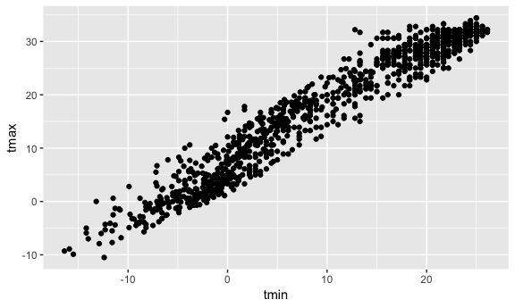
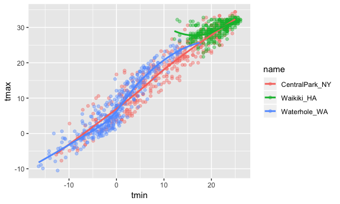
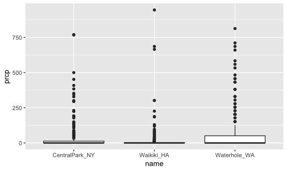

Visualization with ggplot2
================
Eric Morris
9/27/2018

Important NOAA Data
-------------------

``` r
library(rnoaa)

weather_df = 
  rnoaa::meteo_pull_monitors(c("USW00094728", "USC00519397", "USS0023B17S"),
                      var = c("PRCP", "TMIN", "TMAX"), 
                      date_min = "2017-01-01",
                      date_max = "2017-12-31") %>%
  mutate(
    name = recode(id, USW00094728 = "CentralPark_NY", 
                      USC00519397 = "Waikiki_HA",
                      USS0023B17S = "Waterhole_WA"),
    tmin = tmin / 10,
    tmax = tmax / 10) %>%
  select(name, id, everything())
```

Making a plot
-------------

Blank plot..

``` r
ggplot(weather_df, aes(x = tmin, y = tmax))
```


Scatterplot

``` r
ggplot(weather_df, aes(x = tmin, y = tmax)) + 
  geom_point()
```

    ## Warning: Removed 15 rows containing missing values (geom_point).



Filtering Central Park without having to also create a new data frame

``` r
weather_df %>% 
  filter(name == "CentralPark_NY") %>% 
  ggplot(aes(x = tmin, y = tmax)) + 
  geom_point()
```


More plot options
-----------------

``` r
ggplot(weather_df, aes(x = tmin, y = tmax)) + 
  geom_point(aes(color = name))
```

    ## Warning: Removed 15 rows containing missing values (geom_point).


Add a geom (se = FALSE will turn off confidence bands)

``` r
ggplot(weather_df, aes(x = tmin, y = tmax)) + 
  geom_point(aes(color = name)) + 
  geom_smooth(se = FALSE)
```

    ## `geom_smooth()` using method = 'gam' and formula 'y ~ s(x, bs = "cs")'

    ## Warning: Removed 15 rows containing non-finite values (stat_smooth).

    ## Warning: Removed 15 rows containing missing values (geom_point).


Making points more transparent

``` r
ggplot(weather_df, aes(x = tmin, y = tmax)) + 
  geom_point(aes(color = name), alpha = 0.4) + 
  geom_smooth(se = FALSE)
```

    ## `geom_smooth()` using method = 'gam' and formula 'y ~ s(x, bs = "cs")'

    ## Warning: Removed 15 rows containing non-finite values (stat_smooth).

    ## Warning: Removed 15 rows containing missing values (geom_point).


Adding some more options and switching everything around

``` r
ggplot(weather_df, aes(x = tmin, y = tmax, color = name)) + 
  geom_point(alpha = 0.4) + 
  geom_smooth(se = FALSE)
```

    ## `geom_smooth()` using method = 'loess' and formula 'y ~ x'

    ## Warning: Removed 15 rows containing non-finite values (stat_smooth).

    ## Warning: Removed 15 rows containing missing values (geom_point).



Facetting...

``` r
ggplot(weather_df, aes(x = tmin, y = tmax, color = name)) + 
  geom_point(alpha = 0.4) + 
  geom_smooth(se = FALSE) +
  facet_grid( ~ name)
```

    ## `geom_smooth()` using method = 'loess' and formula 'y ~ x'

    ## Warning: Removed 15 rows containing non-finite values (stat_smooth).

    ## Warning: Removed 15 rows containing missing values (geom_point).


A more interesting plot

``` r
ggplot(weather_df, aes(x = date, y = tmax, color = name)) + 
  geom_point()
```

    ## Warning: Removed 3 rows containing missing values (geom_point).


Lines instead of points

``` r
ggplot(weather_df, aes(x = date, y = tmax, color = name)) + 
  geom_line()
```


Back to points and adding more stuff

``` r
ggplot(weather_df, aes(x = date, y = tmax, color = name)) + 
  geom_point(aes(size = prcp), alpha = .5) +
  geom_smooth(se = FALSE) + 
  facet_grid(. ~ name)
```

    ## `geom_smooth()` using method = 'loess' and formula 'y ~ x'

    ## Warning: Removed 3 rows containing non-finite values (stat_smooth).

    ## Warning: Removed 3 rows containing missing values (geom_point).


``` r
ggplot(weather_df, aes(x = date, y = tmax, color = name, size = prcp)) + 
  geom_point(alpha = .5) +
  geom_smooth(se = FALSE) + 
  facet_grid(. ~ name)
```

    ## `geom_smooth()` using method = 'loess' and formula 'y ~ x'

    ## Warning: Removed 3 rows containing non-finite values (stat_smooth).

    ## Warning: Removed 3 rows containing missing values (geom_point).


Univariate Plots
----------------

Histogram

``` r
ggplot(weather_df, aes(x = tmax)) + 
  geom_histogram()
```

    ## `stat_bin()` using `bins = 30`. Pick better value with `binwidth`.

    ## Warning: Removed 3 rows containing non-finite values (stat_bin).


``` r
ggplot(weather_df, aes(x = tmax, fill = name)) + 
  geom_histogram()
```

    ## `stat_bin()` using `bins = 30`. Pick better value with `binwidth`.

    ## Warning: Removed 3 rows containing non-finite values (stat_bin).


Density mapping

``` r
ggplot(weather_df, aes(x = tmax, fill = name)) + 
  geom_density(alpha = 0.5)
```

    ## Warning: Removed 3 rows containing non-finite values (stat_density).


Boxplots

``` r
ggplot(weather_df, aes(x = name, y = tmax)) + 
  geom_boxplot()
```

    ## Warning: Removed 3 rows containing non-finite values (stat_boxplot).


Violin plot?

``` r
ggplot(weather_df, aes(x = name, y = tmax)) + 
  geom_violin()
```

    ## Warning: Removed 3 rows containing non-finite values (stat_ydensity).


ggridges, flipping violins

``` r
ggplot(weather_df, aes(x = tmax, y = name)) + 
  geom_density_ridges()
```

    ## Picking joint bandwidth of 1.84

    ## Warning: Removed 3 rows containing non-finite values (stat_density_ridges).


Saving plots -&gt; adding little knitr snippet at beginning of markdown to make all graphs the same consistent size as well as increasing font size for when you save plots

``` r
weather_plot = ggplot(weather_df, aes(x = tmin, y = tmax)) + 
  geom_point(aes(color = name), alpha = .5) 

ggsave("weather_plot.pdf", weather_plot, width = 8, height = 5)
```

    ## Warning: Removed 15 rows containing missing values (geom_point).

Last example
------------

``` r
ggplot(weather_df, aes(y = prcp, x = name)) +
  geom_boxplot()
```

    ## Warning: Removed 3 rows containing non-finite values (stat_boxplot).



``` r
weather_df %>% 
  filter(prcp > 0) %>% 
  ggplot(aes(x = prcp, fill = name)) +
  geom_density(alpha = .5)
```


