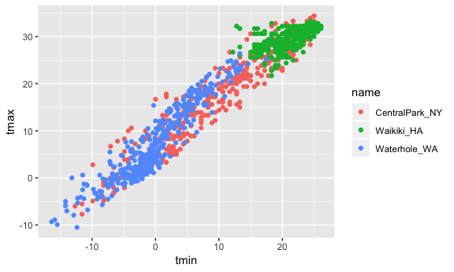
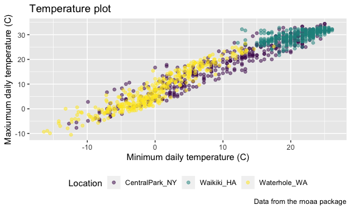

Viz Part 2
================
Eric Morris
10/2/2018

``` r
library(tidyverse)
```

    ## ── Attaching packages ───────────────────────────────────────────────────────────────────────────────── tidyverse 1.2.1 ──

    ## ✔ ggplot2 3.0.0     ✔ purrr   0.2.5
    ## ✔ tibble  1.4.2     ✔ dplyr   0.7.6
    ## ✔ tidyr   0.8.1     ✔ stringr 1.3.1
    ## ✔ readr   1.1.1     ✔ forcats 0.3.0

    ## ── Conflicts ──────────────────────────────────────────────────────────────────────────────────── tidyverse_conflicts() ──
    ## ✖ dplyr::filter() masks stats::filter()
    ## ✖ dplyr::lag()    masks stats::lag()

``` r
library(ggridges)
```

    ## 
    ## Attaching package: 'ggridges'

    ## The following object is masked from 'package:ggplot2':
    ## 
    ##     scale_discrete_manual

``` r
library(patchwork)
library(ggthemes)

knitr::opts_chunk$set(
  fig.width = 6,
  fig.asp = .6,
  out.width = "90%"
)
```

Load the weather data frame

``` r
weather_df = 
  rnoaa::meteo_pull_monitors(c("USW00094728", "USC00519397", "USS0023B17S"),
                      var = c("PRCP", "TMIN", "TMAX"), 
                      date_min = "2017-01-01",
                      date_max = "2017-12-31") %>%
  mutate(
    name = recode(id, USW00094728 = "CentralPark_NY", 
                      USC00519397 = "Waikiki_HA",
                      USS0023B17S = "Waterhole_WA"),
    tmin = tmin / 10,
    tmax = tmax / 10) %>%
  select(name, id, everything())
```

First scatter

``` r
ggplot(weather_df, aes(x = tmin, y = tmax)) + 
  geom_point(aes(color = name))
```

    ## Warning: Removed 15 rows containing missing values (geom_point).



It's a little plain - need to add labels and such

``` r
ggplot(weather_df, aes(x = tmin, y = tmax)) + 
  geom_point(aes(color = name), alpha = .5) + 
  labs(
    title = "Temperature plot",
    x = "Minimum daily temperature (C)",
    y = "Maxiumum daily temperature (C)",
    caption = "Data from the rnoaa package"
  )
```

    ## Warning: Removed 15 rows containing missing values (geom_point).


Changing tick marks and labels

``` r
ggplot(weather_df, aes(x = tmin, y = tmax)) + 
  geom_point(aes(color = name), alpha = .5) + 
  labs(
    title = "Temperature plot",
    x = "Minimum daily temperature (ºC)",
    y = "Maxiumum daily temperature (ºC)",
    caption = "Data from the rnoaa package"
  ) + 
  scale_x_continuous(
    breaks = c(-15, 0, 15), 
    labels = c("-15º C", "0", "15"))
```

    ## Warning: Removed 15 rows containing missing values (geom_point).


Controlling limits and adding scale to y axis

``` r
ggplot(weather_df, aes(x = tmin, y = tmax)) + 
  geom_point(aes(color = name), alpha = .5) + 
  labs(
    title = "Temperature plot",
    x = "Minimum daily temperature (C)",
    y = "Maxiumum daily temperature (C)",
    caption = "Data from the rnoaa package"
  ) + 
  scale_x_continuous(breaks = c(-15, 0, 15), 
                     labels = c("-15ºC", "0", "15"),
                     limits = c(-20, 30)) + 
  scale_y_continuous(trans = "sqrt", 
                     position = "right")
```

    ## Warning in self$trans$transform(x): NaNs produced

    ## Warning: Transformation introduced infinite values in continuous y-axis

    ## Warning: Removed 90 rows containing missing values (geom_point).


Colors and themes
-----------------

Adjust color

``` r
ggplot(weather_df, aes(x = tmin, y = tmax)) + 
  geom_point(aes(color = name), alpha = .5) + 
  labs(
    title = "Temperature plot",
    x = "Minimum daily temperature (C)",
    y = "Maxiumum daily temperature (C)",
    caption = "Data from the rnoaa package"
  ) + 
  scale_color_hue(
    name = "Location",
    h = c(100, 350),
    l = 75)
```

    ## Warning: Removed 15 rows containing missing values (geom_point).


Viridis package for color pallettes and theme to move legend to bottom of plot

``` r
ggplot(weather_df, aes(x = tmin, y = tmax)) + 
  geom_point(aes(color = name), alpha = .5) + 
  labs(
    title = "Temperature plot",
    x = "Minimum daily temperature (C)",
    y = "Maxiumum daily temperature (C)",
    caption = "Data from the rnoaa package"
  ) + 
  viridis::scale_color_viridis(
    name = "Location",
    discrete = TRUE
  ) + 
  theme(legend.position = "bottom")
```

    ## Warning: Removed 15 rows containing missing values (geom_point).



Other theme options

``` r
ggplot(weather_df, aes(x = tmin, y = tmax)) + 
  geom_point(aes(color = name), alpha = .5) + 
  labs(
    title = "Temperature plot",
    x = "Minimum daily temperature (C)",
    y = "Maxiumum daily temperature (C)",
    caption = "Data from the rnoaa package"
  ) + 
  viridis::scale_color_viridis(
    name = "Location",
    discrete = TRUE
  ) + 
  theme_bw() +
  theme(legend.position = "bottom")
```

    ## Warning: Removed 15 rows containing missing values (geom_point).


Learning assessment: tmax against date:

``` r
ggplot(weather_df, aes(x = date, y = tmax, color = name)) + 
  geom_point(aes(size = prcp), alpha = .75) + 
  geom_smooth(se = FALSE) +
  labs(
    title = "Date v. Tmax Assessment",
    x = "Date",
    y = "Maxiumum daily temperature (C)",
    caption = "Data from the rnoaa package"
  ) + 
  viridis::scale_color_viridis(
    name = "Location",
    discrete = TRUE
  ) + 
  theme_bw() +
  theme(legend.position = "bottom")
```

    ## `geom_smooth()` using method = 'loess' and formula 'y ~ x'

    ## Warning: Removed 3 rows containing non-finite values (stat_smooth).

    ## Warning: Removed 3 rows containing missing values (geom_point).


Arguments to geom
-----------------

``` r
centralpark_df = weather_df %>% 
  filter(name == "CentralPark_NY")
waikiki_df = weather_df %>% 
  filter(name == "Waikiki_HA")

ggplot(waikiki_df, aes(x = date, y = tmax, color = name)) +
  geom_point() +
  geom_line(data = centralpark_df)
```

    ## Warning: Removed 3 rows containing missing values (geom_point).


Patchwork
---------

Not using patchwork to create a grid

``` r
ggplot(weather_df, aes(x = date, y = tmax, color = name)) + 
  geom_point(aes(size = prcp), alpha = .75) + 
  geom_smooth(se = FALSE) +
  facet_grid(~name) +
  labs(
    title = "Date v. Tmax Assessment",
    x = "Date",
    y = "Maxiumum daily temperature (C)",
    caption = "Data from the rnoaa package"
  ) + 
  viridis::scale_color_viridis(
    name = "Location",
    discrete = TRUE
  ) + 
  theme_bw() +
  theme(legend.position = "bottom")
```

    ## `geom_smooth()` using method = 'loess' and formula 'y ~ x'

    ## Warning: Removed 3 rows containing non-finite values (stat_smooth).

    ## Warning: Removed 3 rows containing missing values (geom_point).


Using patchwork

``` r
tmax_tmin_p = ggplot(weather_df, aes(x = tmax, y = tmin, color = name)) + 
  geom_point(alpha = .5) +
  theme(legend.position = "none")

prcp_dens_p = weather_df %>% 
  filter(prcp > 0) %>% 
  ggplot(aes(x = prcp, fill = name)) + 
  geom_density(alpha = .5) + 
  theme(legend.position = "none")

tmax_date_p = ggplot(weather_df, aes(x = date, y = tmax, color = name)) + 
  geom_point(alpha = .5) +
  geom_smooth(se = FALSE) + 
  theme(legend.position = "bottom")

(tmax_tmin_p + prcp_dens_p) / tmax_date_p
```

    ## Warning: Removed 15 rows containing missing values (geom_point).

    ## `geom_smooth()` using method = 'loess' and formula 'y ~ x'

    ## Warning: Removed 3 rows containing non-finite values (stat_smooth).

    ## Warning: Removed 3 rows containing missing values (geom_point).


Data manipulation
-----------------

``` r
ggplot(weather_df, aes(x = name, y = tmax, fill = name)) +
  geom_violin()
```

    ## Warning: Removed 3 rows containing non-finite values (stat_ydensity).


Using factors...

``` r
weather_df %>%
  mutate(name = forcats::fct_relevel(name, c("Waikiki_HA", "CentralPark_NY", "Waterhole_WA"))) %>% 
  ggplot(aes(x = name, y = tmax)) + 
  geom_violin(aes(fill = name), color = "blue", alpha = .5) + 
  theme(legend.position = "bottom")
```

    ## Warning: Removed 3 rows containing non-finite values (stat_ydensity).


``` r
weather_df %>%
  mutate(name = forcats::fct_reorder(name, tmax)) %>% 
  ggplot(aes(x = name, y = tmax)) + 
  geom_violin(aes(fill = name), color = "blue", alpha = .5) + 
  theme(legend.position = "bottom")
```

    ## Warning: Removed 3 rows containing non-finite values (stat_ydensity).


``` r
weather_df %>%
  select(name, tmax, tmin) %>% 
  gather(key = observation, value = temp, tmax:tmin) %>% 
  ggplot(aes(x = temp, fill = observation)) +
  geom_density(alpha = .5) + 
  facet_grid(~name) + 
  viridis::scale_fill_viridis(discrete = TRUE)
```

    ## Warning: Removed 18 rows containing non-finite values (stat_density).


New box plotafter data tidying

``` r
pulse_data = haven::read_sas("./data/public_pulse_data.sas7bdat") %>%
  janitor::clean_names() %>%
  gather(key = visit, value = bdi, bdi_score_bl:bdi_score_12m) %>%
  separate(visit, into = c("remove_1", "remove_2", "visit"), sep = "_") %>%
  select(id, visit, everything(), -starts_with("remove")) %>%
  mutate(visit = replace(visit, visit == "bl", "00m"),
         visit = factor(visit, levels = str_c(c("00", "01", "06", "12"), "m"))) %>%
  arrange(id, visit)
```

    ## Warning: attributes are not identical across measure variables;
    ## they will be dropped

``` r
ggplot(pulse_data, aes(x = visit, y = bdi)) + 
  geom_boxplot()
```

    ## Warning: Removed 879 rows containing non-finite values (stat_boxplot).


Using old data after tidying

``` r
pup_data = read_csv("./data/FAS_pups.csv", col_types = "ciiiii") %>%
  janitor::clean_names() %>%
  mutate(sex = recode(sex, `1` = "male", `2` = "female")) 

litter_data = read_csv("./data/FAS_litters.csv", col_types = "ccddiiii") %>%
  janitor::clean_names() %>%
  select(-pups_survive) %>%
  separate(group, into = c("dose", "day_of_tx"), sep = 3) %>%
  mutate(wt_gain = gd18_weight - gd0_weight,
         day_of_tx = as.numeric(day_of_tx))

fas_data = left_join(pup_data, litter_data, by = "litter_number") 

fas_data %>% 
  select(sex, dose, day_of_tx, pd_ears:pd_walk) %>% 
  gather(key = outcome, value = pn_day, pd_ears:pd_walk) %>% 
  na.omit() %>% 
  mutate(outcome = forcats::fct_reorder(outcome, day_of_tx, median)) %>% 
  ggplot(aes(x = dose, y = pn_day)) + 
  geom_violin() + 
  facet_grid(day_of_tx ~ outcome)
```


